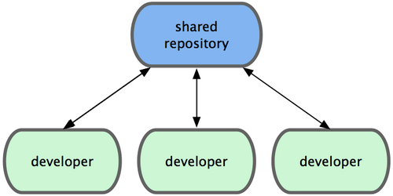

# git的几个问题

## git merge和git rebase区别：
这个文件写的很清楚    
http://git-scm.com/book/zh/v1/Git-%E5%88%86%E6%94%AF-%E5%88%86%E6%94%AF%E7%9A%84%E8%A1%8D%E5%90%88     

## git fetch和git pull区别：
其实git pull相当于：git fetch , git merge     
http://stackoverflow.com/questions/292357/what-are-the-differences-between-git-pull-and-git-fetch    

## 到底是应该使用git pull 还是 git pull --rebase ?
我个人赞同使用git pull --rebase,因为如果多个人开发并且经常pull的话，就会出现很多：`Merge branch 'aaa' of git.xxx.xxx/xxx/xxx into aaa`这样的commit。     
就像这里的讨论：https://ruby-china.org/topics/112

## 我们使用的工作流【集中式工作流】：
http://git-scm.com/book/zh/v1/%E5%88%86%E5%B8%83%E5%BC%8F-Git-%E5%88%86%E5%B8%83%E5%BC%8F%E5%B7%A5%E4%BD%9C%E6%B5%81%E7%A8%8B      
通常，集中式工作流程使用的都是单点协作模型。一个存放代码仓库的中心服务器，可以接受所有开发者提交的代码。所有的开发者都是普通的节点，作为中心集线器的消费者，平时的工作就是和中心仓库同步数据（见图 5-1）。  

如果两个开发者从中心仓库克隆代码下来，同时作了一些修订，那么只有第一个开发者可以顺利地把数据推送到共享服务器。第二个开发者在提交他的修订之前，必须先下载合并服务器上的数据，解决冲突之后才能推送数据到共享服务器上。在 Git 中这么用也决无问题，这就好比是在用 Subversion（或其他 CVCS）一样，可以很好地工作。     
如果你的团队不是很大，或者大家都已经习惯了使用集中式工作流程，完全可以采用这种简单的模式。只需要配置好一台中心服务器，并给每个人推送数据的权限，就可以开展工作了。**但如果提交代码时有冲突， Git 根本就不会让用户覆盖他人代码，它直接驳回第二个人的提交操作。这就等于告诉提交者，你所作的修订无法通过快进（fast-forward）来合并，你必须先拉取最新数据下来，手工解决冲突合并后，才能继续推送新的提交**。 绝大多数人都熟悉和了解这种模式的工作方式，所以使用也非常广泛。
